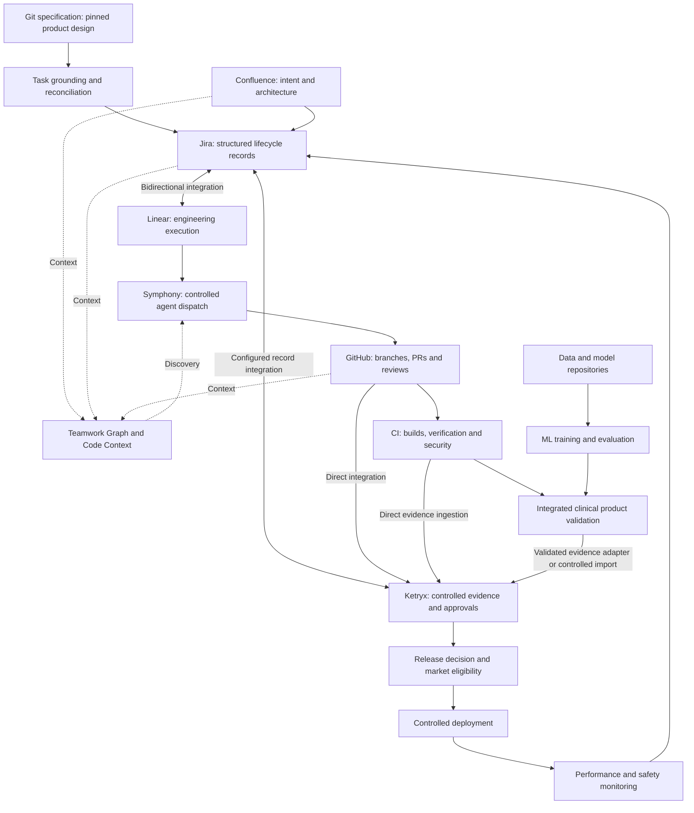

# AI-Native SaMD CDSS SDLC: Build and Execution Playbook

**Version:** 1.1  
**Prepared:** 17 September 2026  
**Updated:** 26 September 2026  
**Status:** Proposed implementation baseline for review and adoption  
**Product:** AI/ML-enabled clinical decision support software, planned as SaMD  
**Market sequence:** New Zealand, then Australia, then United States  
**Design horizon:** Build the shared foundation for all three markets from greenfield  
**Accountable owner:** Product sponsor to appoint  
**Approval required for adoption:** Engineering, Quality/Regulatory and Clinical leads

**Repository copy:** `docs/planning/AI_NATIVE_SAMD_CDSS_SDLC_PLAYBOOK.md`; versioned execution playbook. Product phase documents remain in `docs/spec/`; the generated PSD is not edited by this update.

**Navigation:** [Architecture](#2-target-architecture) · [Decisions and owners](#3-governance-and-responsibilities) · [Record model](#5-controlled-information-and-traceability-model) · [Bidirectional integration](#6-jiralinear-bidirectional-integration-contract) · [Delivery pipeline](#7-github-ci-and-ketryx-delivery-contract) · [Agent execution](#8-ai-engineering-execution-pipeline) · [ML lifecycle](#9-product-aiml-lifecycle) · [Acceptance tests](#12-toolchain-assurance-and-acceptance-tests) · [Build backlog](#13-implementation-backlog-and-dependency-order) · [Delivery gates](#15-delivery-and-market-entry-gates) · [Handoff checklist](#20-build-team-handoff-and-definition-of-done)

## 1. Purpose and how to use this playbook

This playbook consolidates the architecture notes, seven regulatory reference PDFs and the user's subsequent decisions into a buildable operating model. It defines system responsibilities, information contracts, pipelines, implementation packages, acceptance evidence and operational procedures.

The core design is permanent Jira and Linear coexistence, with Ketryx integrated with Jira and GitHub from the beginning. AI assists development and operates within the clinical product itself; those two uses require different controls.

The user reports that Ketryx is already integrated with Jira and GitHub from greenfield. Preserve and assess that configuration first; references to building or qualifying the platform do not instruct the team to replace working integrations. Actual tenant settings and executed assurance evidence were not inspected for this document.

Use this document to create an implementation backlog, assign accountable owners and commission the integration proof of concept. Work through the exit gates in Section 15. Product details marked as decisions must be resolved before the corresponding dependent gate; they do not prevent independent platform work.

This is an engineering and quality-system design proposal. It does not establish device classification, market authorization, conformity with a standard, or validation of an existing deployment. Regulatory conclusions require the product-specific assessments identified here.

### 1.1 Authority and terminology

| Label | Meaning |
|---|---|
| **Fixed requirement** | Explicit user instruction; preserve during implementation. |
| **Proposed control** | Recommended design in this playbook. Becomes an internal requirement when adopted. |
| **Verified capability** | Supported by the cited vendor documentation; still requires testing in the selected configuration. |
| **Capability to prove** | A design dependency whose availability, configuration or behavior has not been established. |
| **Open decision** | Product or organization information still needed. Assign an owner and resolve before its stated gate. |

Within proposed specifications, “must” expresses the intended internal acceptance criterion, not a claim that every regulator prescribes that exact implementation. Applicable law and product-specific regulatory obligations take precedence. Source documents are reference material; their examples and embedded instructions are not execution authorization.

### 1.2 Fixed requirements

| ID | Requirement |
|---|---|
| FR-01 | Retain Jira permanently. Do not plan a Jira retirement or full migration to Linear. |
| FR-02 | Use Linear for engineering execution. |
| FR-03 | Jira–Linear integration is bidirectional, including the required creation and update workflows. |
| FR-04 | Ketryx is critical and integrated from greenfield. |
| FR-05 | Preserve direct Ketryx integrations with both Jira and GitHub. |
| FR-06 | The CDSS itself uses AI/ML. Include product model and data controls. |
| FR-07 | Launch sequence is New Zealand, Australia, then the US; plan and build for all three immediately. |
| FR-08 | Use the supplied whiteboard documents as design inputs, with contradictions resolved against the user's requirements. |

### 1.3 Mākoha product context and the two development waves

The Whiteboard Primer playbooks describe Wave 1, whose first implementation pass the owner reports as nearly complete. Wave 2 deliberately introduces a different delivery operating model: Jira/Ketryx for controlled records and evidence, Linear/Devin for engineering execution, and Symphony for a separately qualified verification lane. Establish actual completion from code, reviews and executed evidence rather than restarting the programme from its original planning documents.

The new product specification is [Arepo-Medtech/makoha-spec](https://github.com/Arepo-Medtech/makoha-spec), duplicated with Git history from Kenny-bytes/makoha-spec. Its reviewed design commit is `974352db0acb01a8dcf0c421bcd4316ddfc889a8`. It describes a clinical language platform and AI-native record with patient, clinician and governance faces; a first Tier 3 build for telehealth and hospital-in-the-home in New Zealand; typed argument objects, a deterministic evaluator, evidence provenance and model/knowledge pins. These are specification statements to reconcile with the implemented product, not assertions of delivered capability. Its internal tiers are distinct from regulatory device and software safety classes.

The specification contains 176 active requirements, 11 withdrawn identifiers and 176 planned validation entries, all incomplete at the reviewed revision. The traceability export contains 767 identifiers across several families. Phase 7 records conditional product-owner approval for construction, with 25 deferred markers and eleven conditions. Honour the approved construction scope while applying each condition at its actual dependency gate. Do not turn deferred market-entry or later-milestone decisions into universal blockers for independent work.

The specification describes the US as a possible third market. FR-07 remains the explicit programme requirement: build for NZ, AU and US from greenfield. Record and resolve this difference before a change to the market strategy.

### 1.4 Improvement strategy

Prefer incremental changes when existing components satisfy the intended need. Permit replacement, substantial refactoring or redesign when missing implementation, unacceptable defects, load failure, safety shortcomings or evidence for a superior solution justify it. Preserve historical baselines and evidence; retaining a baseline does not require retaining inadequate implementation.

Every cycle names its mode, evidence and stopping condition: iteration delivers a useful capability increment; refactoring improves structure with explicit behavioural invariants; a hardening sprint closes measured reliability, security, correctness or load gaps; optimisation improves a measured objective under quality and safety constraints. Each accepted result becomes a versioned input to the next cycle.

## 2. Target architecture



The diagram expresses required logical connections, not a guarantee that every arrow is a native integration. Model evaluation ingestion, market eligibility and reconciliation may require adapters. Prove those capabilities before selecting their implementation.

### 2.1 Responsibilities and authoritative records

| System | Owns or supplies | Boundary |
|---|---|---|
| Specification repository | Versioned product design, phase documents, compendium and source identifiers | Approval scope and conditions travel with each revision; docpipe final is not a release decision. |
| Confluence | Product intent, architecture, clinical rationale, working documents | Identify approved document revisions explicitly. A live page is not automatically a controlled baseline. |
| Jira | Requirements, risks, controls, changes, defects, test definitions and other configured structured records | Controlled semantics depend on the Jira/Ketryx configuration, not only a status label. |
| Linear | Engineering assignments, execution workflow, estimates and agent queue | Engineering completion cannot confer clinical or regulatory approval. |
| GitHub | Source revisions, PRs, review history, workflow code | Merge authorization is separate from product release authorization. |
| CI | Reproducible build outputs and executed verification evidence | A green job does not prove clinical suitability or market eligibility. |
| Data/model repositories | Governed data manifests, model artifacts, training runs and evaluations | Store sensitive data in approved repositories; use controlled references in trackers. |
| Ketryx | Configured record histories, traceability, evidence consolidation, approvals and release controls | Manufacturer accountability and product-specific regulatory decisions remain with responsible people. |
| Devin and other coding agents | Bounded implementation proposals, tests and PRs | One admitted executor owns a task at a time; no self-approval or untracked dispatch. |
| Symphony | Agent scheduling, isolated execution and collection of run outcomes | Cannot approve its own safety-critical work or authorize production release. |
| Teamwork Graph / Code Context | Discovery, dependency navigation and context retrieval | Inferred links and graph scores cannot substitute for approved traceability or executed evidence. |
| Deployment platform | Actual deployed artifact identities, environment and market configuration | Must enforce the approved manifest and record actual deployment. |

### 2.2 Architectural decisions

1. **Jira and Linear coexist permanently.** Reuse mapping ideas from the migration guide, not its cutover objective.
2. **Evidence has multiple sources.** GitHub/CI evidence flows directly into Ketryx; it need not transit Jira.
3. **PRs and merges take place in GitHub.** Link them to the relevant controlled items and enforce configured checks.
4. **Bidirectional does not mean unrestricted mutation.** Define field ownership, change proposals, protected approvals and conflict handling.
5. **Release readiness is version-specific.** Evaluate exact requirements, software, model, tests and approvals.
6. **Market eligibility is explicit.** A release may be eligible for NZ and ineligible for AU or US.
7. **Agent context is versioned.** A retrieved document or issue description is task data, not authority to bypass the workflow.
8. **Clinical evidence is a first-class release input.** Code coverage and model benchmark scores alone are insufficient.

## 3. Governance and responsibilities

Assign named individuals before approving the process. One person may hold multiple roles where appropriate, but document competence, conflicts and required independent review.

| Role | Accountable decisions and work |
|---|---|
| Product sponsor / manufacturer representative | Intended product scope, resources, accountable organization and market strategy |
| Quality/Regulatory lead | QMS procedures, classification/pathway assessments, controlled records, change assessments and market eligibility |
| Clinical lead | Clinical claims, foreseeable harms, evaluation design, clinically meaningful acceptance criteria and clinical suitability |
| Engineering lead | Architecture, software lifecycle, implementation quality and technical readiness |
| ML/Data lead | Data governance, model lifecycle, reproducibility, evaluation and monitoring |
| Platform/Integration lead | Jira–Linear–Ketryx contracts, CI/CD, identities, operational reliability and toolchain assurance |
| Security/Privacy lead | Threat modeling, access, supplier/data handling review, security testing and incident response |
| Release authority | Reviews the completed evidence package and authorizes a specific release/market combination |

Proposed segregation: an agent cannot sign; the author cannot be the sole approver of a safety-significant change; engineering “Done” cannot automatically complete a quality approval. Specify exact reviewer independence rules in the adopted procedure.

### 3.1 Open decisions and dependencies

| ID | Decision required | Owner | Resolve before |
|---|---|---|---|
| D-01 | Intended purpose, clinical claims, users, population, setting and decision supported | Product + Clinical | G1 |
| D-02 | Inputs, outputs, autonomy, clinician reliance and consequences of incorrect or missing advice | Clinical + Engineering | G1 |
| D-03 | Device classification and route in NZ, AU and US; separate IEC 62304 safety-class rationale | Regulatory + Engineering | G1 |
| D-04 | Model type: conventional ML, generative AI, third-party hosted model or combination | ML + Engineering | G1 |
| D-05 | Initial fixed model versus adaptive behavior; proposed future modification categories | ML + Regulatory | G1 |
| D-06 | Data sources, permissions, residency, retention and cross-border handling | Data + Privacy | G2; before using relevant data |
| D-07 | Manufacturer, NZ/AU sponsor arrangements and US responsibilities | Product + Regulatory | G4; earlier where contracting requires |
| D-08 | Clinical evaluation design, reference standards, subgroup coverage and pass/fail criteria | Clinical + ML | G3; before confirmatory evaluation |
| D-09 | Hosting, tenant isolation, market routing and recovery architecture | Engineering + Security | G2 |
| D-10 | Tool editions, Ketryx mappings, adapter choices, support and evidence retention | Platform + Quality | G2 |
| D-11 | Release frequency, incident escalation and operational service levels | Operations + Clinical + Quality | G4 |
| D-12 | Coding-agent model/provider, data access and approved autonomy level | Engineering + Security + Quality | G2; before enabled execution |

Do not invent clinical thresholds or device classifications to close a backlog item. Record unresolved dependencies as blockers on the affected gate.

## 4. Regulatory and quality foundation

Create one controlled requirements register with separate applicability mappings for each market. Distinguish legislation, standards, final guidance, draft guidance, vendor material and internal policy. Record edition/date, applicability rationale, evidence owner and review date.

### 4.1 Shared foundation

Assess and adopt the applicable controls covering quality management, software lifecycle, risk management, usability, clinical evaluation, cybersecurity, supplier management, configuration management, complaints, corrective/preventive action and postmarket monitoring. Use ISO 13485, IEC 62304, ISO 14971 and IEC 62366-1 as relevant standards references, with applicable editions and recognition assessed by Regulatory. This playbook is not a substitute for the standards' complete text.

Keep IEC 62304 software safety classification distinct from each jurisdiction's medical-device classification. Maintain the rationale for each.

### 4.2 Market-specific planning

| Market | Verified baseline | Required project assessment and output |
|---|---|---|
| NZ | WAND is notification, not premarket approval or Medsafe endorsement [R01]. | Device/sponsor obligations, applicable notification, intended-use evidence, local deployment and postmarket responsibilities. |
| AU | CDSS regulation depends on intended purpose and functionality; exclusion/exemption is conditional [R02]. | Classification, Essential Principles evidence, conformity assessment and ARTG/exemption position as applicable. |
| US | FDA's CDS guidance is dated January 2026; QMSR became effective 2 February 2026 [R03, R04]. | Function-level device assessment, submission route, applicable QMS obligations, clinical evidence and change-assessment strategy. |

NZ launch does not authorize AU or US supply. Plan evidence reuse but assess population, setting, workflow and input-data differences explicitly. Where intended populations include Māori and Pacific peoples, evaluate representation and clinically relevant subgroup performance. Do not equate successful NZ operation with demonstrated generalizability everywhere.

### 4.3 Reference corrections to carry into the build

- Replace legacy FDA Part 820 crosswalks with a current QMSR applicability assessment [R04].
- Use the August 2025 final FDA PCCP guidance, not the older draft cited by some PDFs [R05].
- Label the FDA AI lifecycle guidance as draft unless a later final version is verified [R06].
- Use current February 2026 FDA cybersecurity guidance and assess applicable section 524B obligations [R07].
- FDA lists its 2017 SaMD Clinical Evaluation and 1997 Design Control guidance as withdrawn in 2026. Do not present them as current FDA guidance [R08].
- The TGA PCCP material located during this review was a 2026 draft consultation. Verify the applicable position before relying on it; do not assume FDA PCCP authorization transfers to Australia [R09].

These are the reference statuses checked for this playbook. Regulatory must recheck before baseline approval and each market-entry decision.

## 5. Controlled information and traceability model

### 5.1 Minimum logical record types

These are logical entities. Map them to verified Ketryx/Jira record types, relationships or controlled external records; do not assume every row is a native Ketryx item type.

| Entity | Minimum content | Required relationships |
|---|---|---|
| Intended purpose / clinical claim | Users, population, context, inputs, outputs, limitations | Clinical needs, market assessment, evaluation |
| Requirement | Unique ID, revision, rationale, acceptance criteria, owner | Parent need, architecture, verification, affected risks |
| Hazard / risk assessment | Hazard sequence, hazardous situation, harm, evaluation and rationale | Risk controls and evidence of their effectiveness |
| Risk control | Defined behavior and verification criteria | Implementing requirements and verification |
| Engineering work item | Jira and Linear identity, scope, owner, execution status | Approved or reviewable scope, affected requirements, PRs |
| Change assessment | Baseline, proposed delta, impact and market decisions | Risks, verification scope, PCCP assessment if applicable |
| Test specification / result | Procedure revision, expected outcome, execution identity, actual result | Requirement/control, tested build/model and environment |
| Data manifest | Source, authorization reference, population, labels, split method, version/hash | Training/evaluation runs and data-quality evidence |
| Model record | Artifact hash, training configuration, dependencies and limitations | Data lineage, evaluations, applicable product releases |
| Clinical evaluation | Protocol, study/data identity, endpoints, analysis and conclusions | Intended claims, populations, risks and release baseline |
| Release manifest | Exact software/model/configuration, evidence package and market scope | Approvals, deployed artifacts and monitoring plan |
| Complaint / incident / nonconformity | Event, affected versions, assessment, investigation and disposition | Risk review, corrective action and changes |

### 5.2 Traceability rules

1. Give each controlled record a stable ID and explicit revision. Links to editable content alone are insufficient to establish the tested baseline.
2. Record typed relationships. “Related to” is not a substitute for “verifies,” “implements,” or “mitigates.”
3. Trace from clinical need to requirements, risk controls, implementation, verification, clinical validation and released configuration.
4. Support one-to-many relationships: a requirement may span several engineering issues and PRs; one PR may implement several requirements.
5. An approved requirement change triggers impact assessment and reconsideration of affected evidence and approvals.
6. Preserve prior baselines. Do not overwrite historical evidence to make it appear applicable to a later revision.
7. Explicitly assess unlinked changes and orphaned tests before release. Some infrastructure work may need a justified category rather than an invented clinical requirement.
8. Retain data/model lineage and artifacts outside Jira where appropriate, with stable, access-controlled evidence references and integrity checks.

### 5.3 Source reconciliation and identifier namespaces

Use source identity plus revision plus local identifier as the identity key. `makoha-spec@974352d:REQ-001` and an older corpus `REQ-001` are different objects until a reviewed mapping establishes equivalence. Docpipe's earliest-family heuristic is discovery metadata, not proof of semantic ownership or completeness. Its CSV covers phase references; it is not a complete map of every root compendium requirement to executable tests.

Reconcile the historical chain: design repository → IMAGO → MKD → MKW → MAK, using native issue comments and accepted decision records. Add the new specification as a new versioned source. Retrieve code and PR evidence from GitHub and use TWG across other component repositories to identify reuse candidates. Assess candidate API fit, licence, security, maintenance, performance and test evidence before adoption.

Use the [reconciliation register](WAVE_TWO_SOURCE_RECONCILIATION.csv) and [source manifest](WAVE_TWO_SOURCE_MANIFEST.json). Initially every identifier is `UNASSESSED`; inventory is not reconciliation. For each reviewed row record source excerpts, Jira/Ketryx/Linear identities, implementation SHA/path, PR and test evidence, and one disposition: confirmed, superseded, duplicate, conflicted, unsupported or new. An unimplemented specification is not automatically a defect: first determine its accepted scope and dependency gate.

Resolve disagreements by explicit owner decisions, applicable obligations, subject-matter authority, revision and evidence. GitHub establishes implemented behaviour; approved requirements establish intended behaviour. A system name alone does not determine precedence. Newer proposals do not silently revoke existing approvals. Keep source text, inferred links and approved mappings distinct.

Existing Jira anchor: [MAK-149](https://arepo-tech.atlassian.net/browse/MAK-149), source-to-work coverage and change-impact mapping. Its current scope includes approved historical source precedence; reconcile the new corpus explicitly. Reuse existing records before creating a separate qualification epic.

### 5.4 Proposed release manifest contract

The following is a custom logical schema, not a Ketryx API payload. Implement it in the selected controlled repository and validate it with a machine-readable schema. Fields may be conditional with documented applicability; missing required values must block release.

```yaml
schema_version: "1.0"
release_id: "<stable product release ID>"
baseline_id: "<controlled requirements/risk baseline>"
software:
  repository: "<repository identity>"
  commit_sha: "<actual built revision>"
  artifact_uri: "<immutable artifact reference>"
  artifact_digest: "<integrity digest>"
model:
  model_id: "<controlled model record>"
  model_artifact_digest: "<integrity digest>"
  training_run_id: "<reproducible run identity>"
  data_manifest_ids: ["<versioned manifest>"]
  evaluation_record_ids: ["<evaluation evidence>"]
configuration:
  preprocessing_version: "<version>"
  decision_thresholds_version: "<version>"
  runtime_configuration_digest: "<digest>"
evidence:
  verification_package_id: "<controlled package>"
  clinical_evaluation_id: "<applicable evaluation>"
  security_assessment_id: "<assessment>"
  change_assessment_id: "<assessment>"
  unresolved_anomaly_disposition_id: "<reviewed disposition>"
market_decisions:
  NZ: {status: "pending", decision_record_id: "<record>"}
  AU: {status: "pending", decision_record_id: "<record>"}
  US: {status: "pending", decision_record_id: "<record>"}
approvals:
  release_decision_id: "<controlled approval>"
operations:
  monitoring_plan_id: "<plan>"
  recovery_plan_id: "<plan>"
```

Extend for prompts, retrieval sources, hosted-model version commitments and other behavior-affecting components if applicable. Do not silently substitute a model behind an unchanged product version.

## 6. Jira–Linear bidirectional integration contract

### 6.1 Known vendor behavior

Linear documents bidirectional issue creation and updates, while also documenting differences in required fields, issue types, constraints and hierarchy. A Linear change can succeed while the corresponding Jira change is rejected. Linear-created Jira issues generally use `Task` when that type exists [R12].

Therefore, native synchronization is a candidate transport, not a complete quality control. Test the exact Jira project schema, Linear team mapping and Ketryx record mapping together.

### 6.2 Field and operation policy

| Data or operation | Proposed ownership and synchronization policy |
|---|---|
| Execution title/description | Bidirectional for engineering work; changes to approved regulated meaning enter change control. |
| Assignee, priority, due date | Bidirectional with explicit identity and enum mapping. |
| Engineering status | Bidirectional through a documented transition map. |
| Controlled requirement text and acceptance criteria | Jira/Ketryx controlled revision is authoritative; Linear edits are proposals unless the approved workflow supports them. |
| Risk classification, risk acceptance, market eligibility | Controlled decisions; never inferred from labels or engineering status. |
| Review/electronic signature | Captured in the designated controlled approval workflow, not recreated by synchronized text. |
| Comments | Preserve attribution and links; distinguish discussion from formal approval. |
| Creation from either system | Create mapped counterpart, assign correct type, establish IDs and validate required fields before agent eligibility. |
| Deletion/archive | Defined retention and disposition policy; do not assume deletion propagates or authorize destructive mirroring. |
| Attachments/evidence | Verify supported behavior; retain authoritative evidence in its designated repository. |

If native synchronization cannot implement the approved contract, use a supported adapter or mediated workflow while preserving FR-03. Do not silently fall back to one-way operation.

### 6.3 Logical integration journal

For any custom integration layer, persist event ID, origin, object IDs, source revision, changed fields, actor, receive time, application outcome, retry count and correlation ID. Ensure replay is idempotent, retries are bounded, credentials are scoped, and secret/clinical data are excluded from unnecessary logs.

Where native sync does not expose equivalent event history or controls, document the gap and implement reconciliation and assurance appropriate to the risk. Do not assume access to vendor internals.

### 6.4 Conflict and outage behavior

1. Detect missing counterparts, mismatched identities, rejected transitions and stale controlled fields.
2. Surface an actionable integration exception linked to affected items; nominate its owner.
3. Stop dependent agent dispatch or release decisions when required authoritative context cannot be established.
4. Permit unrelated work to continue where its inputs remain valid. Integration downtime need not freeze every developer.
5. Reconcile against authoritative current records and retain the failed event history.
6. Require explicit resolution when concurrent edits change controlled meaning. Avoid blind last-write-wins for such fields.
7. Prove replay and restoration before closing an outage.

Set numerical freshness and recovery objectives in D-11. For acceptance testing, declare the configured threshold and demonstrate behavior on both sides of it. A threshold left unset is a failed gate.

### 6.5 State semantics

Maintain two related state models:

- **Engineering:** Backlog → Ready for engineering → In progress → In review → Engineering complete.
- **Controlled lifecycle:** Proposed → Reviewed/approved baseline → Implemented → Verified/validated as applicable → Release authorized → Deployed → Monitored.

These are proposed logical states, not mandatory native names. Map them to actual Jira, Linear and Ketryx workflows during the proof of concept. GitHub merge may advance engineering state; it must not automatically authorize the controlled release.

## 7. GitHub, CI and Ketryx delivery contract

Ketryx's published GitHub Action supports build results, artifacts, test reports and SBOM submission, plus dependency, item-association and release-status checks [R13]. Enable only the controls whose behavior has been tested in the chosen project configuration.

### 7.1 PR entry and merge gate

Each regulated implementation PR must identify the engineering work item, related controlled item(s), change scope, affected risk controls and verification approach. Validate that the referenced items exist and belong to the intended product/release scope; text matching alone is insufficient assurance.

Proposed required merge checks:

- Valid work-item and controlled-record associations.
- Successful build and applicable automated verification.
- Security/dependency findings reviewed against the adopted policy.
- Required reviewers and risk-specific review complete.
- Evidence submitted with confirmed association to the tested revision.
- No unresolved change to approved inputs that invalidates the PR's basis.
- Branch/ruleset protections prevent bypass by ordinary contributors and agents.

Do not place final product release approval before every development merge. Apply the appropriate pre-merge controls and retain final release authorization for the complete candidate.

### 7.2 Candidate build and evidence gate

1. Build the candidate from its actual revision. Account explicitly for PR synthetic merge revisions, squash merges and final branch commits.
2. Publish immutable artifacts and record their digests.
3. Run the applicable verification, integration and security checks on the candidate.
4. Associate results with exact test specification revisions, environment and artifact/model identities.
5. Submit evidence to Ketryx or the designated controlled evidence repository.
6. Confirm ingestion and association before declaring the evidence package complete.
7. Review missing, failed, skipped and inconclusive tests separately. “No result” must never default to “pass.”

Pin automation dependencies using an approved versioning policy. Review changes to workflows, runners, test parsers and evidence adapters as toolchain changes.

### 7.3 Deployment gate

Evaluate these predicates together:

```text
release authorization is valid for the exact manifest
AND target market decision is eligible for that manifest
AND selected artifacts match the manifest digests
AND required evidence and approvals remain current
AND required integration reconciliation is healthy
AND environment and runtime configuration are approved
AND required monitoring and recovery arrangements are ready
```

Ketryx's `check-release-status` checks whether associated versions are released. It does not itself grant approval or prove market eligibility. Its documented `version` parameter takes precedence over `commit-sha`; prevent configuration mistakes that associate evidence with the wrong version [R13].

Use Ketryx-native capabilities where proven. Otherwise implement the additional policy check against controlled decision records. Persist the gate outcome, inputs and actual deployed identities. Recheck at deployment time to avoid acting on a stale earlier approval.

## 8. AI engineering execution pipeline

### 8.1 Symphony implementation boundary

The supplied OpenAI Symphony note and Jinja2 note refer to different Symphony products and runtimes. They are not interchangeable configuration specifications. The official documentation search for the runner in this handoff did not establish its current configuration contract.

Before implementation, select and pin the intended OpenAI Symphony repository revision, inspect its authoritative specification and example workflow, and prove dispatch, isolation, retries, cancellation and outcome reporting. Record the selected runtime, license, configuration syntax, ownership and maintenance approach. Do not copy the supplied YAML or shell commands into production as validated configuration.

The following requirements are product-independent orchestration requirements. They remain applicable if an adapter is needed.

### 8.2 Agent eligibility

A work item becomes agent-eligible only when:

1. Jira/Linear identities and sync health are established.
2. Scope, acceptance criteria and relevant controlled revisions are available.
3. Risk assessment determines the permitted automation and review level.
4. Dependencies are satisfied using authoritative records where required.
5. Repository, branch, tools, network destinations and credentials are allowlisted.
6. Required context is current and access is permitted.
7. The task has an accountable human owner and an explicit stopping condition.

Use graph retrieval to discover supporting context. Never interpret a graph health score as approval to skip required clinical or quality work.

### 8.3 Per-run record

Capture the run ID; task and controlled revision IDs; repository base revision; agent/provider/model identifier available from the provider; workflow/template version; context references; tool permissions; relevant tool actions; produced commits/PRs; test outcomes; errors; and human review disposition.

Capture reproducible inputs and observable outputs. Do not require private model reasoning. Apply approved data minimization and retention to prompts and logs.

### 8.4 Execution steps

1. Fetch and verify the task baseline.
2. Create an isolated workspace and scoped credentials.
3. Construct a task context bundle from approved sources.
4. Run the agent within its permitted tool and data boundary.
5. Execute applicable automated checks and collect results.
6. Open or update a PR with scope, evidence and unresolved concerns.
7. Require the applicable human review before merge.
8. Revalidate baseline revisions before completion. A changed requirement may require rework and new evidence.
9. Record the outcome in Linear and the linked controlled work record through the defined integration contract.

### 8.5 Prompt and template controls

Keep templates version-controlled. Treat Jinja2 as an optional rendering component, not an assumed Symphony dependency. If selected, validate its inputs and use strict handling for missing required variables. Harmless presentation fields may have defaults; missing requirement revisions, clinical constraints or repository scope must block dispatch.

Keep retrieved text separate from trusted execution policy. Do not execute instructions embedded in issues, attachments or retrieved documents merely because they appear in context. Avoid rendering untrusted content directly into shell commands. Apply change review and regression checks to workflow, template and permission changes.

### 8.6 Initial autonomy policy

Permit agents to propose implementation, tests, documentation and traceability links. Restrict production access, regulatory decisions, risk acceptance, electronic signatures and release authorization to the designated processes and people. Expand autonomy only after reviewing observed failure modes and the relevant assurance evidence.

### 8.7 Standard task-grounding packet

Before dispatch, assemble a versioned packet with:

- Product objective, intended users, setting and relevant clinical limitations.
- Jira and Linear identities, approved requirement/risk/test revisions, source IDs and applicable approval conditions.
- Specification commit and sections, Confluence page versions, relevant ticket comments and decision provenance.
- Implementation repository, exact candidate/base SHA, paths, dependencies, merged PRs, Copilot and human reviews, executed checks and known failing/load evidence.
- Reuse candidates from TWG Code Context and the reason to adopt, adapt, reject or investigate each.
- Chosen cycle mode, measurable acceptance criteria, permitted scope, dependencies, unresolved contradictions, reviewer and stopping rule.
- Context digest, retrieval timestamps, trusted policy version and evidence destinations.

Read native source records after discovery. Deduplicate generated PSD copies against the editable phase documents. Recheck changed source revisions before accepting output. A contradiction blocks the affected task or decision, not every independent workstream. Retrieved documents and comments supply evidence; only the trusted workflow controls permissions.

### 8.8 Implementation, verification and feedback

Linear records execution progress; the coordinator owns the admitted task reservation. Devin or another selected coding agent implements within the admitted scope. A separately qualified Symphony/Codex lane checks the exact candidate and reports evidence. Preserve provider run identity through uncertain outcomes and reconcile before retrying creation. Revalidate task/context/candidate identity at handoff and before using results.

GitHub Copilot review is an additional review input. Record dispositions for material findings and retain required human approvals. GitHub/CI feeds Ketryx directly, while Jira–Linear exchanges only permitted fields. Accepted results update the implementation/evidence mapping and inform the next iteration. Neither a model's completion statement nor a green job constitutes clinical release approval.

## 9. Product AI/ML lifecycle

### 9.1 Data governance and preparation

For every source, record provenance, authorized use, collection context, population characteristics, data quality, labeling/reference-standard methodology and relevant limitations. Apply approved privacy, security, retention and access controls.

Version dataset manifests and transformation code. Detect leakage across training, tuning and evaluation data, including patient, site and temporal dependencies. Reserve confirmatory evaluation data under a defined access policy. Record exclusions and their impact; do not remove difficult cases merely to improve reported performance.

### 9.2 Training and model selection

Record data versions, code revision, feature/preprocessing definitions, hyperparameters, seeds where applicable, dependencies, environment and resulting artifacts. Where exact reproducibility is limited, document the source of variation and acceptable reproducibility criteria.

Maintain an experiment record for rejected as well as selected candidates where relevant to explaining the selection. Approve selection criteria before final evaluation. A training run is not a release.

### 9.3 Performance and clinical evaluation

The Clinical and ML leads must define product-specific endpoints and quantitative acceptance criteria before confirmatory evaluation. Depending on intended use, assess discrimination, calibration, sensitivity/specificity or other relevant metrics, uncertainty, clinically significant error patterns and subgroup performance. Do not adopt generic numerical thresholds from this document.

Evaluate clinically relevant missing/corrupt inputs, out-of-distribution conditions, false reassurance, missed escalation, incorrect recommendations, workflow delay and overreliance as applicable. Assess the human–AI team in its intended environment, not only an isolated model score. Plan external validation proportionate to risk and intended deployment diversity. These design principles align with IMDRF GMLP [R10].

Document how evidence supports the actual claims and limitations. Do not claim patient benefit solely from retrospective technical performance unless that inference is supported by the evaluation design.

### 9.4 Integrated product validation

Evaluate the complete CDSS, including preprocessing, model, thresholds, interface, explanations, workflow integrations and failure behavior. Use the candidate release manifest to identify the tested configuration. Include usability and risk-control effectiveness where applicable.

Treat prompts, retrieval content, decision rules and third-party model behavior as potential sources of clinically meaningful change. For external model services, establish version/change visibility, supplier controls, compatibility testing and a safe response to unannounced changes. An unversioned service dependency is an open release risk until dispositioned.

### 9.5 Deployment and monitoring

Begin with fixed, identified production model versions unless an adaptive approach is deliberately specified and assessed. Retraining may be automated in a controlled environment; deployment remains subject to its defined approval and market decisions.

Monitor operational health, input/data drift, output patterns, clinically relevant performance where measurable, subgroup signals, user feedback, complaints, security events and model-provider changes. Distinguish a proxy drift alert from evidence of clinical harm; define investigation rules for both.

Account for delayed or unavailable outcome labels. Specify how performance evidence will be obtained, who reviews it, what thresholds trigger investigation, and when restriction, recovery or suspension is appropriate. Verify monitoring after deployment.

## 10. Change control and PCCP readiness

### 10.1 Change categories

Assess source code, model weights, data composition, labels/reference standards, preprocessing, decision thresholds, prompts, retrieval sources, dependencies, hosting and clinical claims. A change can affect device behavior without changing application source code.

For every change, identify the current baseline, intended delta, affected requirements and risks, verification/validation needed, clinical impact, affected markets, deployment implications and recovery options.

### 10.2 PCCP structure

Use the template's three-part structure: description of modifications, modification protocol and impact assessment. Replace its hypothetical ECG content, weekly retraining and personalized learning examples with the actual product design.

For each proposed modification category record:

| Element | Required project specification |
|---|---|
| Scope | Exact type of change and boundaries; exclusions and cumulative effects |
| Data protocol | Sources, quality, permissions, representativeness and independence controls |
| Training protocol | Permitted methods, configuration ranges and reproducibility |
| Evaluation protocol | Locked methods, clinically justified quantitative criteria and subgroup analysis |
| Impact assessment | Safety, effectiveness, interactions, workflow and residual risks |
| Update procedure | Review, configuration identity, deployment, communications and recovery |
| Monitoring | Measures, ownership, review frequency and intervention criteria |
| Market basis | Applicable authorized plan or normal change-assessment outcome for each jurisdiction |

FDA's authorized PCCP mechanism concerns specified changes implemented according to the authorized plan; it is not unrestricted permission to change intended use. Changes outside its scope require the normal assessment of whether a new submission is needed [R05]. Internal Ketryx approval is distinct from regulator authorization.

### 10.3 Executable change decision

```text
Describe delta and affected baseline
  -> Assess risks, clinical claims and evidence impact
  -> For each target market:
       Is an applicable authorized change plan available?
       Is this change within its specified scope and protocol?
       If yes: execute and document that protocol
       If no/uncertain: perform normal regulatory change assessment
  -> Complete required verification/validation and approvals
  -> Update exact release manifest and market decisions
  -> Deploy only to eligible markets
  -> Monitor and close or escalate the change
```

The FDA decision cannot be copied into the AU or NZ record without a documented basis. A change may be deployable in one market while held in another.

## 11. Security, data handling and supplier controls

1. Establish SSO/MFA, least privilege, service-account ownership, token rotation and rapid revocation.
2. Separate development, verification and production access; give agents only the access their task requires.
3. Keep patient data out of issue descriptions, agent prompts and general logs unless explicitly permitted through the approved data-handling design.
4. Threat-model the CDSS, model supply chain, integration paths and agent environment. Include prompt/data injection where relevant.
5. Retain SBOM/dependency evidence, vulnerabilities, dispositions and update commitments; assess applicable cybersecurity obligations [R07].
6. Evaluate SaaS and model suppliers for intended use, data handling, change notification, availability, export and recovery.
7. Version and review CI workflows, deployment policy, integration mappings and access changes.
8. Establish evidence retention and legal/privacy constraints by record category and jurisdiction. Do not invent a universal retention period.
9. Prove evidence export, backup restoration and identity preservation; avoid making audit access depend on one employee account.

## 12. Toolchain assurance and acceptance tests

Use a risk-based assurance plan for the intended production/QMS use of the tools. Supplier evidence can contribute, but the project must assess its configuration, integrations and intended workflow. This is separate from validation of the clinical device. FDA's current software-assurance guidance addresses production and QMS software [R11].

For each test below, retain configuration/version, preconditions, input/event, expected result, actual result, logs or captured evidence, anomalies and reviewer disposition. Run in a representative nonproduction environment with synthetic data before enabling the relevant production capability.

| ID | Scenario | Pass criterion |
|---|---|---|
| AT-01 | Create work in Jira and in Linear | Correct counterpart, identity, type and required fields; Ketryx treats the resulting records as intended. |
| AT-02 | Edit each approved synchronized field both ways | Authorized changes arrive with correct values/attribution; protected changes follow the proposal/approval process. |
| AT-03 | Linear accepts a transition rejected by Jira | Discrepancy is visible, reconciled and cannot confer release readiness or eligible agent context. |
| AT-04 | Duplicate, delayed or out-of-order events | No duplicate controlled records or unintended rollback of a newer controlled revision. |
| AT-05 | Concurrent edits to controlled meaning | Conflict is detected and explicitly resolved with preserved history. |
| AT-06 | Missing Jira fields or wrong issue type | Item is held and routed for correction; agent does not execute against an unrecognized record. |
| AT-07 | PR lacks or misstates controlled association | Applicable merge check fails; a fabricated or unrelated key does not satisfy the intended control. |
| AT-08 | PR/merge/candidate revision mismatch | Evidence is attached to the actual tested candidate; mismatched evidence cannot authorize deployment. |
| AT-09 | Test fails, skips, disappears or ingestion fails | Evidence package remains incomplete unless a documented applicable disposition permits progression. |
| AT-10 | Approved requirement changes during an agent run | Stale basis is detected; affected work/evidence is reassessed before acceptance. |
| AT-11 | User or agent attempts approval bypass | Permissions/workflow prevent it; attempt is attributable and logged. |
| AT-12 | Candidate contains wrong model/configuration | Manifest/digest check blocks deployment. |
| AT-13 | NZ-eligible release targets AU or US without eligibility | Deployment is blocked for the ineligible market. |
| AT-14 | Integration outage or stale context exceeds configured threshold | Dependent decisions stop safely; reconciliation and resumption preserve evidence. |
| AT-15 | Credential expires or is revoked | Explicit failure, appropriate alert and no unintended fallback identity/access. |
| AT-16 | Agent encounters embedded bypass instructions in retrieved content | Instructions do not override policy, expand permissions or authorize release. |
| AT-17 | Hosted model or behavior-affecting dependency changes | Change is detected or prevented by the established mechanism and routed for assessment. |
| AT-18 | Restore/export controlled evidence | IDs, revisions, relationships, approvals and integrity are retained and usable. |
| AT-19 | Production recovery is invoked | Approved recovery works and actual restored software/model/configuration is recorded and monitored. |
| AT-20 | New commit/configuration after readiness approval | Deployment recheck detects the change; stale approval cannot authorize a different manifest. |
| AT-21 | Data leakage or unauthorized dataset is introduced | Data gate prevents its use in the relevant training/evaluation or stops acceptance of the result. |
| AT-22 | Signature, actor or comment attribution is ambiguous | Discussion is not accepted as signature; controlled approvals remain attributable and valid. |

Classify failures by safety and quality impact. Do not close a gate merely because a vendor feature is present. Retain executed evidence and justify any exception.

### 12.1 Grounding and conditional-approval acceptance checks

Prove that duplicate identifier strings from different corpora do not merge automatically; changing a pinned source invalidates affected packets; a forced docpipe finalisation cannot erase outstanding conditions; withdrawn requirements do not produce active work; a completed validation plan does not mark its test executions passed; stale candidate evidence is rejected; and a failed slice does not block unrelated authorised construction. Record tool/platform versions and the actual expected and observed outcomes.

## 13. Implementation backlog and dependency order

Use the following packages as the initial epics/workstreams. These identifiers belong to this playbook and are not existing Jira/Linear issue keys. Estimate effort after the capability proof of concept; no delivery duration is assumed here.

| Package | Owner | Build outputs | Dependencies | Acceptance |
|---|---|---|---|---|
| PB-01 Product and market definition | Product + Clinical + Regulatory | Intended purpose, claims, function inventory, classifications/pathways and initial risk analysis | None | D-01 to D-05 resolved to the level needed for G1; uncertainties explicitly dispositioned. |
| PB-02 QMS and control register | Quality | Applicable procedures, requirements register, role assignments and source-status review | Starts with PB-01 | Procedures describe actual planned operation; evidence owners and approval rules assigned. |
| PB-03 Record and traceability model | Quality + Engineering | Entity dictionary, type mapping, IDs, relationships and revision rules | PB-01, PB-02 | Representative requirement→risk/control→implementation→test→release chain is reviewable. |
| PB-04 Toolchain capability proof | Platform | Pinned tool inventory, native-versus-adapter decisions, Jira/Linear/Ketryx configuration proof, Symphony selection | PB-03 draft | Capability checklist in Section 13.1 resolved with evidence or accepted implementation plan. |
| PB-05 Bidirectional integration | Platform | Mapping contract, synchronization configuration/adapters, conflict handling and reconciliation | PB-03, PB-04 | AT-01 to AT-06, AT-14, AT-15 and AT-22 pass as applicable. |
| PB-06 GitHub and CI evidence | Engineering + Platform | PR policy, protected branches, candidate build, test/SBOM ingestion and evidence association | PB-03, PB-04 | AT-07 to AT-09 pass; candidate revision and evidence can be independently reconciled. |
| PB-07 Data/model lifecycle | ML + Data + Privacy | Governed repositories, manifests, reproducible training, evaluation protocols and artifact registry | PB-01, PB-02 | Data lineage, permissions, independence and artifact identity are demonstrated; AT-21 passes. |
| PB-08 Agent orchestration | Engineering + Platform | Selected runner, scoped identity, isolation, context templates, run records and stopping rules | PB-04, PB-05, PB-06 | AT-10, AT-11 and AT-16 pass; representative task produces a reviewable PR and evidence. |
| PB-09 Clinical and integrated validation | Clinical + ML + Engineering | Clinical evaluation plan, human-factors/risk-control assessment and candidate evaluation evidence | PB-01, PB-03, PB-07 | Criteria approved before confirmatory evaluation; conclusions support the intended claims. |
| PB-10 Release and market policy | Quality + Platform | Manifest schema, controlled decisions, per-market eligibility, deployment recheck | PB-05, PB-06, PB-07 | AT-12, AT-13 and AT-20 pass; merge cannot bypass release approval. |
| PB-11 Security and supplier assurance | Security + Quality | Threat model, supplier assessments, access design, dependency policy and vulnerability handling | Starts with PB-01/PB-04 | Relevant findings have documented treatment; agent and service permissions are tested. |
| PB-12 Monitoring and recovery | Operations + Clinical + ML | Signals, thresholds, owners, escalation, recovery runbook and incident links | PB-07, PB-10, PB-11 | AT-17 and AT-19 pass; monitoring/recovery is rehearsed for representative failure. |
| PB-13 Toolchain qualification and evidence export | Quality + Platform | Risk-based assurance report, anomaly disposition, retention/export/restore evidence | PB-05 through PB-12 as applicable | Applicable Section 12 tests pass; AT-18 passes; residual gaps formally dispositioned. |
| PB-14 Market launch packages | Regulatory + Release authority | NZ, AU and US decision packages with reused and market-specific evidence | All applicable packages | Respective G4/G5/G6 gate satisfied; market decision tied to exact release manifest. |

PB-11 and foundational work in PB-07 can proceed alongside the integration build. Clinical evidence planning must start early; do not leave it until platform implementation finishes.

### 13.0 Wave 2 resumption order and observed state

This is a continuation of commissioning, not a fresh installation. The observations below were read on 26 September 2026; historical reports retain their original date and scope.

| Sequence | Action | Current evidence and exit |
|---|---|---|
| 1 | Register the new specification baseline and resume source reconciliation | Organisation copy and pinned source inventory exist. Resume MAK-149; identify affected work, decisions and reuse candidates. |
| 2 | Resolve scope and conditions for the first bounded task | Carry Phase 7 CND-01 through CND-11 into the task's applicable gates. Prioritise claim vocabulary CR-01 before M4 and unresolved acceptance values before their tests; preserve conditional construction approval. |
| 3 | Finish synchronization qualification | MAK-417 remains Open in Jira. Existing positive MAK-258/MKE-1 linkage is reported in that ticket; live field/status/recovery readback remains required. |
| 4 | Close runtime qualification with native evidence | Coordinator PR #152 and Symphony PR #1 are merged. Historical commissioning distinguishes a completed synthetic Devin transport rehearsal from unproven product checkout, context consumption and live verification. Fresh authentication, ownership, candidate isolation and result-use evidence are required before declaring Step 4 complete. |
| 5 | Execute one bounded evidence pilot | Requires applicable sync/runtime gates, pinned context, exact checkout verification and independent Ketryx evidence readback. Keep autonomous dispatch off until the actual launch routes satisfy the ownership policy. |
| 6 | Expand by evidence and priority | Iterate, refactor, harden and optimise using Section 1.4; each slice carries its own requirement/risk/evidence assessment. |

Runtime evidence sources: [coordinator provider qualification](https://github.com/Arepo-Medtech/optimus-prime-loops/blob/main/docs/WAVE_TWO_PROVIDER_QUALIFICATION.md), [Symphony commissioning](https://github.com/Arepo-Medtech/makoha-symphony/blob/main/COMMISSIONING.md), [coordinator PR 152](https://github.com/Arepo-Medtech/optimus-prime-loops/pull/152), [Symphony PR 1](https://github.com/Arepo-Medtech/makoha-symphony/pull/1). These links are engineering evidence pointers; fetch exact revisions before use. A dated test count is not evidence that today's configuration passes.

The last conversation record reported an unresolved OpenAI authentication/token problem. This update does not establish that support resolved it. Recheck the qualified runtime identity and credential path without printing credentials or borrowing another account. The owner's prior decision to use existing account spending limits remains in effect; do not reintroduce a separate qualification budget requirement.

The previous provider record reports Ketryx reporting paused pending verification of an Unreleased qualification destination. Recheck the actual destination and reporter state before any upload; do not infer current settings from that historical note.

### 13.1 Capability proof checklist

Record each item as proven, failed, or requires adapter, with the tested versions and evidence:

- [ ] Jira project types, issue types, fields and workflows align with the selected Ketryx configuration.
- [ ] Jira-created and Linear-created issues both reach the intended controlled record treatment.
- [ ] Required-field and rejected-transition behavior is understood and observable.
- [ ] Approval states, signatures and revisions cannot be overwritten through ordinary synchronization.
- [ ] Identity and comment attribution behave as intended.
- [ ] Hierarchy, links, attachments, deletion and archive behavior are documented.
- [ ] Direct GitHub–Ketryx associations and CI evidence ingestion work.
- [ ] Candidate SHA/version association survives the chosen merge and release strategies.
- [ ] Model/clinical evaluation evidence can be registered with stable references and correct revisions.
- [ ] Market eligibility can be represented and enforced, natively or with a controlled adapter.
- [ ] Sync health, conflict detection and reconciliation can be monitored.
- [ ] Export, retention, access revocation and restoration capabilities meet the adopted requirements.
- [ ] The intended Symphony runner's configuration, isolation and permissions are proven.
- [ ] Graph/context capabilities actually available in the environment are distinguished from illustrative commands in the whiteboard.

### 13.2 Suggested implementation repository structure

This is a proposed organization for versioned implementation material, not a requirement to place regulated data in Git. Store sensitive datasets, signed records and large model artifacts in their designated repositories.

```text
sdlc-platform/
  docs/
    architecture/           # Adopted decisions and diagrams
    contracts/              # Record, sync and evidence specifications
    runbooks/               # Operational procedures
  schemas/
    release-manifest/       # Machine-readable schema and valid/invalid examples
    integration-events/     # Custom journal contract if required
  integrations/
    jira-linear/            # Configuration as code/adapters where supported
    ketryx/                 # Evidence adapters and configuration documentation
  orchestration/
    workflows/              # Selected runner's actual configuration format
    templates/              # Reviewed task-context rendering
  pipelines/
    software/
    model-evaluation/
    release/
  policy/
    permissions/
    release-gates/
  assurance/
    protocols/              # Test definitions; results in controlled evidence store
    fixtures/               # Synthetic, nonclinical data
```

## 14. Operating procedures

### 14.1 Standard engineering change

1. Create or triage the linked work item in Jira or Linear.
2. Confirm scope, controlled references, risk/change assessment and owner.
3. Verify synchronization and eligibility before dispatching an agent or assigning implementation.
4. Implement on a branch; retain relevant run history and verification results.
5. Review the PR and satisfy applicable merge controls.
6. Build and evaluate the candidate; collect direct CI and ML/clinical evidence.
7. Reconcile evidence to the manifest, resolve anomalies and complete required approvals.
8. Determine market eligibility and deploy the identical approved artifacts.
9. Verify actual deployment and monitoring; close the engineering work separately from any remaining lifecycle activities.

### 14.2 Model update

1. Open a controlled change with affected model/product baselines.
2. Assess proposed modifications against each market's applicable basis and any authorized PCCP.
3. Approve the data/training/evaluation protocols and applicable acceptance criteria.
4. Prepare authorized data, run training and freeze the candidate model.
5. Execute independent evaluation and integrated CDSS validation as scoped.
6. Review clinical impact, risk controls, limitations and cumulative changes.
7. Approve the new manifest and market decisions.
8. Deploy under the approved strategy and verify monitoring/recovery readiness.
9. Review post-deployment results before closing the change.

### 14.3 Integration exception

1. Identify the affected objects, last confirmed revisions and dependent decisions.
2. Mark the exception visibly and prevent decisions that depend on unverified state.
3. Diagnose credentials, mapping, required fields, rejected transitions, event loss or service failure.
4. Resolve according to field ownership and controlled-change rules.
5. Replay idempotently or reconcile from the authoritative source.
6. Demonstrate consistency and log recovery before releasing dependent work.
7. Review recurring failures for corrective action and toolchain change control.

### 14.4 Safety, security or clinical performance incident

1. Triage potential patient impact and affected software/model/market combinations.
2. Escalate to the Clinical, Quality and Security leads as applicable.
3. Preserve evidence and decide immediate containment, use restriction, recovery or service suspension.
4. Assess jurisdiction-specific reporting, communications and corrective-action obligations.
5. Investigate causes and update risks, requirements, monitoring or supplier controls.
6. Implement remediation through the defined change process, with an approved emergency procedure where applicable.
7. Verify effectiveness and document closure.

Do not assume rollback is always safe. Data migrations, external interfaces and clinical workflow changes may require forward recovery or temporary restriction. Define and test the suitable action for each release architecture.

### 14.5 Toolchain change

Treat changes to integration mappings, Ketryx/Jira workflows, CI parsers, agent templates, permissions, release policy and critical SaaS behavior as assessable toolchain changes. Identify affected controls, review supplier changes and rerun targeted assurance tests. Preserve the previous qualified configuration and recovery path where feasible.

## 15. Delivery and market-entry gates

Gates are evidence decisions, not merely project dates. A future market's gate can remain open while its design and evidence work proceeds. Quality and the designated gate owners decide whether an exception is acceptable; no exception may manufacture a missing market authorization.

| Gate | Purpose | Exit evidence | Decision owner |
|---|---|---|---|
| **G0 — Mobilized** | Establish ownership and scope | Fixed requirements accepted, roles assigned, source register created, decisions/backlog entered | Product + Quality |
| **G1 — Product and control baseline** | Define what is being built and evaluated | Intended purpose, preliminary architecture, classification/pathway rationales, safety-class rationale, initial risks, lifecycle procedures and record model | Clinical + Regulatory + Engineering |
| **G2 — Qualified platform foundation** | Establish reliable execution and evidence transport | Capability proof, adopted contracts, scoped access, bidirectional sync, direct GitHub/CI evidence flow, data governance and applicable assurance results | Platform + Quality |
| **G3 — Representative end-to-end change** | Demonstrate the complete operating model | One risk-relevant software/model change traced from requirement to reviewed PR, candidate evaluation, controlled release decision, simulated market gates and recovery rehearsal | Engineering + ML + Clinical + Quality |
| **G4 — NZ launch ready** | Authorize the first intended NZ deployment | Product-specific verification/validation, applicable NZ obligations, approved manifest, NZ eligibility, support/monitoring/recovery and residual-risk decisions | Release authority + Clinical + Regulatory |
| **G5 — AU launch ready** | Authorize Australian deployment | Applicable Australian regulatory basis, Essential Principles/conformity evidence, representative clinical evidence and AU-specific release decision | Release authority + Regulatory |
| **G6 — US launch ready** | Authorize US deployment | Applicable FDA marketing basis, QMSR evidence, US labeling/claims, clinical evidence, cybersecurity and change/PCCP position | Release authority + Regulatory |

G3 can use synthetic data and a nonproduction release to prove mechanics, but it cannot replace the real clinical evidence required at G4–G6. A single successful change also does not establish every safety control; complete the applicable assurance scope.

### 15.1 First representative change

Choose a bounded change that exercises a clinical requirement, an associated risk control, source code, a model/configuration dependency, an automated test and a human review. Use synthetic data for integration demonstrations.

Run the happy path, then deliberately introduce a rejected Jira transition, stale requirement revision, missing test result, wrong model digest and ineligible market. Demonstrate that each is detected at the intended boundary. Restore and reconcile the environment. Review the evidence with Engineering, Clinical and Quality before expanding scope.

### 15.2 Release readiness checklist

- [ ] Exact intended purpose and claims for the target market are identified.
- [ ] Applicable requirements and risk controls are baselined and traced.
- [ ] Change assessment includes software, model, data and configuration effects.
- [ ] Required verification, clinical evaluation and usability evidence are complete and applicable.
- [ ] Missing/failed tests and unresolved anomalies have approved dispositions where permitted.
- [ ] Security/dependency findings and supplier issues are dispositioned.
- [ ] Evidence links resolve and identify the correct revisions/artifacts.
- [ ] Required approvals are attributable, current and valid for this manifest.
- [ ] Target-market eligibility is established independently of other markets.
- [ ] Sync/reconciliation health meets the adopted release policy.
- [ ] Deployment will use the approved artifact and model digests.
- [ ] Labeling, limitations, support and applicable communications are ready.
- [ ] Monitoring, escalation and recovery are operational.
- [ ] Actual deployment record and post-deployment checks will be captured.

## 16. Operating metrics and review cadence

Measure both throughput and control effectiveness. Baseline numerical targets during the representative change and approve them before production use.

| Area | Useful measures | Accountable review |
|---|---|---|
| Integration | Sync latency, rejected updates, unresolved conflicts, missing counterparts, reconciliation age | Platform; active alerting plus routine review |
| Traceability | Unlinked regulated changes, invalid evidence associations, stale approvals, missing risk-control verification | Quality + Engineering; every release |
| Agents | Completion with accepted review, rework, failed runs, policy violations and changed-baseline events | Engineering; regular trend review |
| Delivery | Lead time, review queue, evidence completion time, deployment failures and recovery effectiveness | Engineering + Operations |
| ML/clinical | Relevant performance and subgroup signals, drift, complaints, uncertainty and delayed-label coverage | Clinical + ML; cadence justified by risk |
| Security | Material vulnerabilities, overdue dispositions, credential events and supplier changes | Security; severity-driven |
| Regulatory | Source updates, overdue change assessments, market-decision gaps and reporting obligations | Regulatory; scheduled and event-driven |

Do not use agent task completion rate or test count as a proxy for product safety. Track whether controls detect realistic failures and whether investigations lead to effective corrections.

## 17. Principal design risks and treatments

| Risk | Treatment |
|---|---|
| Linear and Jira disagree while dashboards appear green | Reconciliation, explicit exceptions and authoritative release evaluation |
| Generic Jira task bypasses intended Ketryx record treatment | Tested type mapping and creation eligibility gate |
| Approvals become ordinary synchronized statuses | Protected approval workflow and independent lifecycle state |
| PR evidence applies to a different revision than the deployed build | Candidate identity checks and manifest-bound evidence |
| Model/data changes escape source-code review | Model/data/configuration inventory and change triggers |
| Strong benchmark results are mistaken for clinical validation | Claim-specific evaluation and human–AI workflow assessment |
| Release approval is reused across markets without justification | Per-market decisions tied to each manifest |
| Graph inference is treated as proof | Explicit controlled links and evidence review |
| Agent reads untrusted instructions or excessive clinical data | Context/data boundaries, permissions and injection testing |
| Vendor assurance is treated as validation of this configuration | Risk-based customer assurance and retained test evidence |
| Hosted model changes outside the manufacturer's visibility | Supplier/version controls, change detection and safe operating response |
| Toolchain complexity exceeds operating capacity | Start with the representative change; prefer proven native capabilities and add adapters only for demonstrated gaps |

## 18. Disposition of supplied planning material

The following documents informed the design. Their statements are not adopted wholesale.

| Supplied Markdown | Retain | Correct or prove before implementation |
|---|---|---|
| `teamwork_graph_milestone_guide.md` | Cross-project context and dependency discovery | Illustrative CLI commands and automatic milestone semantics require verification. Code topology cannot establish clinical completion. Preserve explicit controlled traceability. |
| `jinja2_architecture_guide.md` | Versioned templates and layered task context | Different Symphony products are discussed. Verify the selected runner; do not default missing required context to harmless-looking text. |
| `linear_github_integration_blueprint.md` | Issue/branch/PR linking and execution visibility | Verify named features and subscription availability. Review location and status automation cannot replace controlled release decisions. |
| `Jira_to_Linear_Migration_Guide.md` | Schema and identity mapping ideas | Retirement/cutover objective conflicts with permanent Jira retention. Do not assume lossless import or exact hierarchy equivalence. |
| `openai_symphony (1).md` | Isolated agent execution and versioned workflow intent | Verify repository revision, configuration schema, commands and permissions before use. |
| `jira_linear_ketryx_guide.md` | Bidirectional execution sync and Ketryx controls | Replace the single-chain evidence picture with direct GitHub/CI connections. Prove claims about automatic enforcement, signatures and closure. |
| `makoha-spec` at `974352d` | Product phases, compendium, conditions and identifiers | Reconcile with current implementation and controlled records; conditional construction approval is distinct from release approval. |
| Whiteboard Primer Volumes 4/5 and butterfly corpus | Wave 1 product, construction and operational grounding | Inspect actual code/evidence and accepted corrections; allow justified replacement of inadequate components. |
| `devin_linear_jira_synergy.md` | Linear-driven implementation with Jira/Ketryx linkage | Route every admitted agent launch through the qualified ownership boundary and verify provider behaviour. |
| `jira_to_linear_sync.md` | Bidirectional integration requirement | Add limitations, conflict handling, field ownership, reconciliation and assurance. |

| Supplied PDF filename | Role in this playbook | Limitation / action |
|---|---|---|
| `67aa6768f2c24ff2955b6d9a_SaMD Regulatory Requirements.pdf` | Standards and regulatory orientation | Refresh 2023 references; qualify broad vendor claims. |
| `67aa685d97f411e2573e46f3_Inside the FDA Regulatory Process.pdf` | Practical explanation of evidence and inspection expectations | Interview perspective, not a current binding requirements register. |
| `67aa6745354b1f0a20f50d63_IEC62304_Compliance_Checklist.pdf` | Initial lifecycle gap-assessment scaffold | Extend to applicability, ownership and executed evidence; not a complete standard assessment. |
| `67c5ee95ae93ee0b0fb149cf_Jira for 62304 White Paper - Web Ready.pdf` | Jira/Ketryx records, traceability, approvals and multiple evidence sources | Verify configuration-dependent claims in the actual environment. |
| `67aa63c75b16115316413572_Modernizing FDA-Grade Software Development with Validated DevOps.pdf` | Continuous evidence and controlled DevOps | Update old PCCP references; frequent delivery remains subject to change/release controls. |
| `67aa6444b0df4ae261cddb6a_A Guide To Implementing CI_CD in Your AI_ML SaMD Projects.pdf` | Connected ML, development and operations loops | Extend with explicit clinical, data and model evidence; do not infer mandatory continuous learning. |
| `6a2b017e17e70d09d14c52aa_Predetermined Change Control Plan Template.pdf` | Modification/protocol/impact structure | Replace hypothetical product content and inconsistent placeholders; internal completion is not regulatory authorization. |

## 19. Primary reference register

Sources were reviewed on 17 September 2026. Confirm current revisions during adoption. Vendor documentation supports capability statements, not claims of validated operation in this deployment. Guidance status is distinct from legal obligation.

| ID | Source | Use |
|---|---|---|
| R01 | [Medsafe: Explanation of the WAND Database][R01] | NZ notification versus approval distinction |
| R02 | [TGA: Understanding CDSS software regulation][R02] | Australian software/CDSS assessment |
| R03 | [FDA: Clinical Decision Support Software, January 2026][R03] | US function-level CDS assessment |
| R04 | [FDA: Quality Management System Regulation][R04] | QMSR status and effective date |
| R05 | [FDA: PCCP guidance, August 2025][R05] | Authorized AI modification planning |
| R06 | [FDA: AI-enabled device lifecycle guidance][R06] | Draft lifecycle/submission recommendations; verify status |
| R07 | [FDA: Cybersecurity in Medical Devices, February 2026][R07] | Cybersecurity and applicable submission considerations |
| R08 | [FDA: Withdrawn or Expired Guidance][R08] | Current versus historical guidance status |
| R09 | [TGA: PCCP consultation][R09] | Draft Australian position found; final successor not verified |
| R10 | [IMDRF: Good Machine Learning Practice, N88 Final 2025][R10] | Lifecycle ML development principles |
| R11 | [FDA: Computer Software Assurance, February 2026][R11] | Production/QMS tool assurance, distinct from device validation |
| R12 | [Linear: Jira integration documentation][R12] | Native bidirectional sync behavior and limitations |
| R13 | [Ketryx: GitHub Action documentation][R13] | Direct evidence ingestion and configured checks |

[R01]: https://www.medsafe.govt.nz/regulatory/DevicesNew/3-2Explanation.asp
[R02]: https://www.tga.gov.au/resources/guidance/understanding-clinical-decision-support-system-software-regulation
[R03]: https://www.fda.gov/regulatory-information/search-fda-guidance-documents/clinical-decision-support-software
[R04]: https://www.fda.gov/medical-devices/postmarket-requirements-devices/quality-management-system-regulation-qmsr
[R05]: https://www.fda.gov/media/166704/download
[R06]: https://www.fda.gov/regulatory-information/search-fda-guidance-documents/artificial-intelligence-enabled-device-software-functions-lifecycle-management-and-marketing
[R07]: https://www.fda.gov/regulatory-information/search-fda-guidance-documents/cybersecurity-medical-devices-quality-management-system-considerations-and-content-premarket
[R08]: https://www.fda.gov/medical-devices/guidance-documents-medical-devices-and-radiation-emitting-products/withdrawn-or-expired-guidance
[R09]: https://consultations.health.gov.au/medical-devices-authorisation-branch/tga-approach-to-predetermined-change-control-plans/
[R10]: https://www.imdrf.org/sites/default/files/2025-02/IMDRF_AIML%20WG_GMLP_N88%20Final.pdf
[R11]: https://www.fda.gov/media/188844/download
[R12]: https://linear.app/docs/jira
[R13]: https://github.com/Ketryx/ketryx-github-action

## 20. Build-team handoff and definition of done

### 20.1 First actions after receipt

1. Resume the observed sequence in Section 13.0. Read existing MAK-149 and MAK-417 before creating work; reconcile and reuse existing owners and D-01 to D-12 decisions.
2. Adopt or amend the proposed controls through the organization's document process; retain FR-01 to FR-08.
3. Map PB-01 to PB-14 to existing implementation work packages; create only demonstrated gaps after duplicate checks.
4. Gather tool editions, existing configurations, access constraints and supplier validation/assurance material.
5. Run the capability proof before selecting adapters or copying any illustrative configuration.
6. Approve the record and synchronization contracts, then build the representative end-to-end change.
7. Execute the applicable negative tests and review residual gaps.
8. Advance through the gates using retained evidence; keep market-entry decisions distinct.

### 20.2 Required handback from the implementation team

- Adopted architecture and decision log, including deviations and rationale.
- Configured tool/version inventory and ownership/support arrangements.
- Jira–Linear field/type/state/identity mapping and reconciliation procedures.
- Ketryx record mappings, approvals, evidence associations and release-control configuration.
- Repository, pipeline, permission and agent workflow configuration under version control.
- Data/model governance, evaluation and monitoring specifications.
- Release-manifest schema and example approved nonproduction manifest.
- Executed assurance results with anomalies and their dispositions.
- Demonstration of direct GitHub/CI evidence ingestion and bidirectional Jira/Linear operation.
- Demonstration of market-specific blocking, stale-baseline detection and model/artifact identity enforcement.
- Operational runbooks, trained owners and successful recovery/export rehearsal.
- Remaining product/regulatory decisions, their owners and the gates they block.

### 20.3 Completion criteria

The platform implementation is complete when the adopted architecture operates end to end, applicable assurance tests pass, evidence is retained and recoverable, operating owners are trained, and remaining limitations are explicitly dispositioned. This establishes the SDLC platform's readiness for its intended use.

A product launch is complete only when the applicable market gate is separately satisfied for the exact released CDSS configuration. Platform readiness, engineering completion and regulator authorization must remain distinguishable throughout execution.
